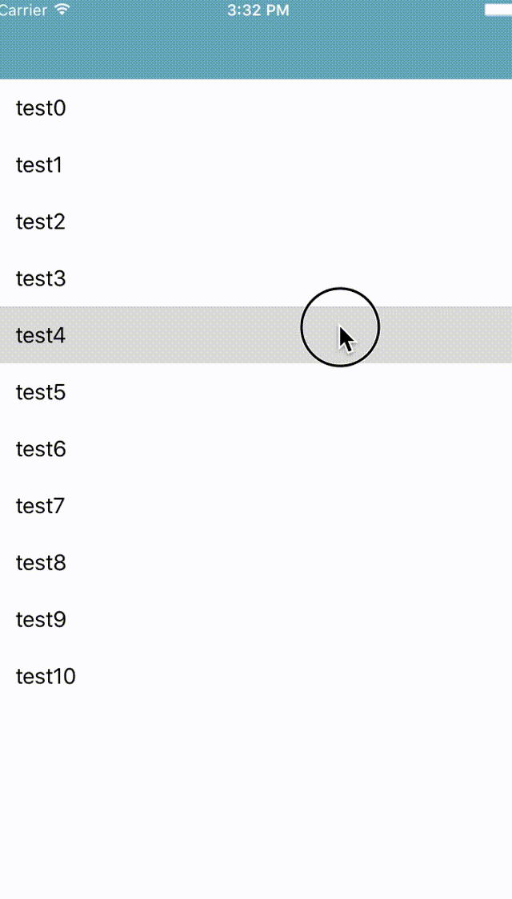

# WavePullToRefresh

[](http://cocoapods.org/pods/WavePullToRefresh)
[](http://cocoapods.org/pods/WavePullToRefresh)
[](http://cocoapods.org/pods/WavePullToRefresh)

WavePullToRefresh is "Pull To Refresh" Library.
You can add animated "Pull To Refresh" action to your Class extends UIScrollView.

## ScreenShot


## Usage

1) Import WavePullToRefreshView

```swift
import WavePullToRefreshView
```

2) Add "Pull To Refresh" to your Class that extends UIScrollView.

#### Simple Usage

```swift
self.tableView.addPullToRefresh { [weak self] in
    yourAsyncTask(completion: {
        self?.tableView.stopPullToRefresh()
    })
}
```

#### Example usage with options

```swift
let options = WavePullToRefreshOption()
options.fillColor = UIColor.re.CGColor
let imageView = UIImageView(image: UIImage(named: "Image"))
options.indicatorImageView = imageView

self.tableView.addPullToRefresh(options: options) { [weak self] in
    yourAsyncTask(completion: {
        self?.tableView.stopPullToRefresh()
    })
}
```

### Options

* [animationStartOffsetY](#animationstartoffsety)
* [dropDuration](#dropduration)
* [dropY](#dropy)
* [fillColor](#fillcolor)
* [indicatorColor](#indicatorcolor)
* [indicatorImageView](#indicatorimageview)

#### `animationStartOffsetY`
The trigger offsetY of starting animation.
**`default: 80`**
```swift
    public var animationStartOffsetY: CGFloat = 80
```
#### `dropDuration`
(millisec)
**`default: 0.75`**
```swift
    public var dropDuration: NSTimeInterval = 0.75
```
#### `dropY`
The position that the drop finish dropping.
**`default: screen height * 0.85`**
```swift
    public var dropY: CGFloat = UIScreen.mainScreen().bounds.height * 0.85
```
#### `fillColor`
**`default: color of screenshot`**
```swift
    public var fillColor = UIColor(red: 106/255, green: 172/255, blue: 184/255, alpha: 1).CGColor
```
#### `indicatorColor`
**`default: white`**
```swift
    public var indicatorColor = UIColor.whiteColor().CGColor
```
#### `indicatorImageView`
ImgeView in dropping.
**`default: nil`**
```swift
    public var indicatorImageView: UIImageView?
```

## Requirements
Swift 2.2+
Xcode 7.3+
iOS 8.0+

## Installation

WavePullToRefresh is available through [CocoaPods](http://cocoapods.org). To install
it, simply add the following line to your Podfile:

```ruby
pod "WavePullToRefresh"
```

If you don't use CocoaPods, just add Class folder into your project.

## Credits

WaveSwipeRefresh is owned and maintained by [RECRUIT LIFESTYLE CO., LTD.](http://www.recruit-lifestyle.co.jp/)

WaveSwipeRefresh was originally created by [Daisuke Kobayashi](https://github.com/enkaism)  

## License

```
Copyright 2016 RECRUIT LIFESTYLE CO., LTD.

Licensed under the Apache License, Version 2.0 (the "License");
you may not use this file except in compliance with the License.
You may obtain a copy of the License at

http://www.apache.org/licenses/LICENSE-2.0

Unless required by applicable law or agreed to in writing, software
distributed under the License is distributed on an "AS IS" BASIS,
WITHOUT WARRANTIES OR CONDITIONS OF ANY KIND, either express or implied.
See the License for the specific language governing permissions and
limitations under the License.

```
